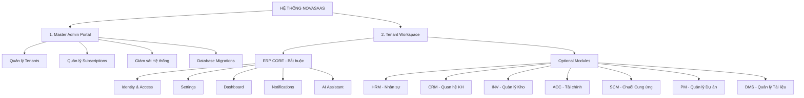
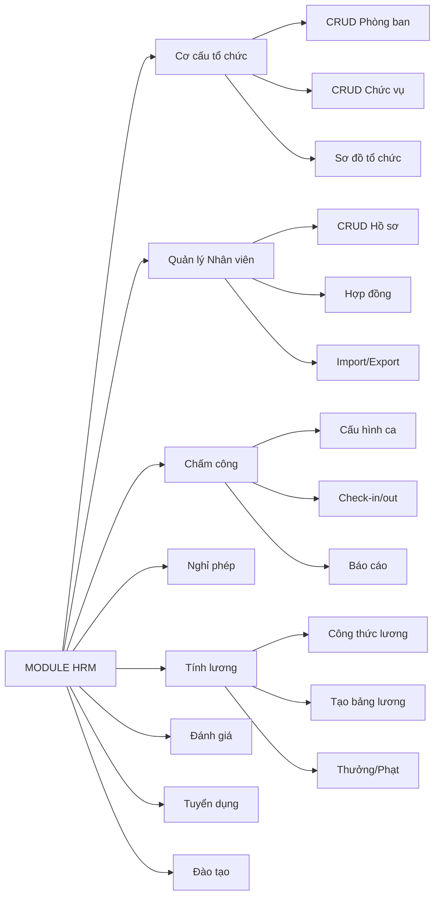
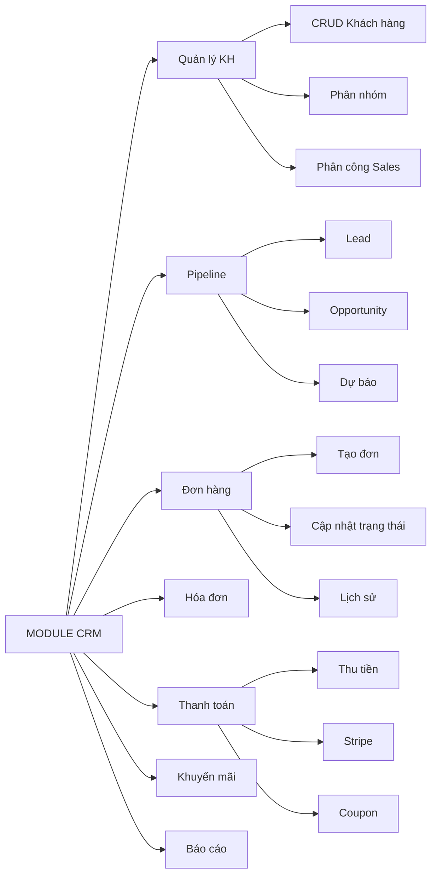
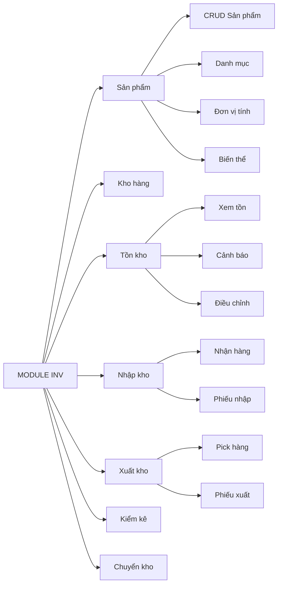
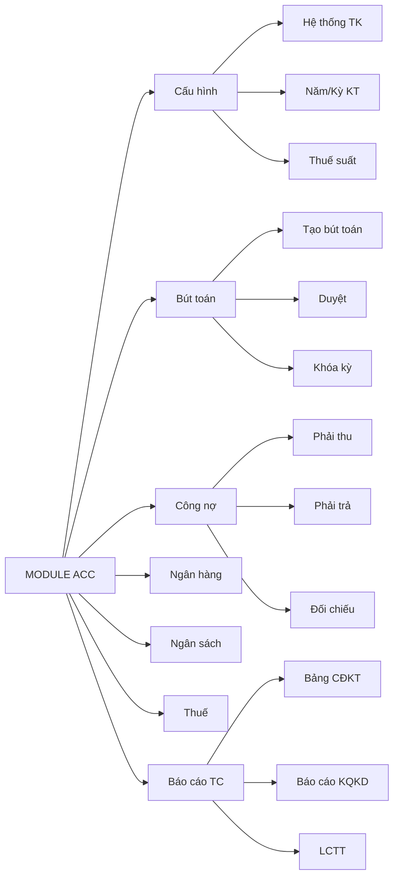
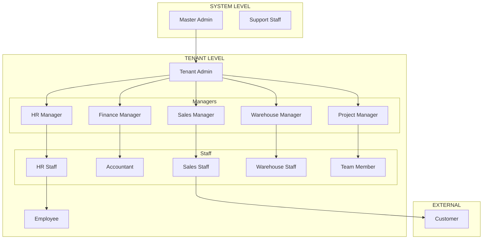

# 📊 SƠ ĐỒ PHÂN CẤP CHỨC NĂNG NOVASAAS

> **Phiên bản:** 1.0  
> **Ngày tạo:** 07/02/2026  
> **Mô tả:** Sơ đồ phân cấp tất cả chức năng của hệ thống NovaSaaS ERP

---

## 📋 MỤC LỤC

1. [Sơ đồ tổng quan hệ thống](#1-sơ-đồ-tổng-quan-hệ-thống)
2. [Chi tiết từng Module](#2-chi-tiết-từng-module)
3. [Sơ đồ Mermaid](#3-sơ-đồ-mermaid)

---

## 1. SƠ ĐỒ TỔNG QUAN HỆ THỐNG

```
┌───────────────────────────────────────────────────────────────────────────────────────────────────┐
│                                        HỆ THỐNG NOVASAAS                                          │
│                              (Cloud-based Multi-tenant ERP Platform)                              │
├───────────────────────────────────────────────────────────────────────────────────────────────────┤
│                                                                                                   │
│   ┌───────────────────────────────────────────────────────────────────────────────────────────┐   │
│   │                            1. QUẢN TRỊ HỆ THỐNG (MASTER ADMIN)                            │   │
│   ├───────────────────────────────────────────────────────────────────────────────────────────┤   │
│   │  1.1 Quản lý Tenants          1.2 Quản lý Subscriptions      1.3 Giám sát Hệ thống        │   │
│   │      ├─ Xem danh sách             ├─ Xem gói subscription         ├─ Xem System Logs      │   │
│   │      ├─ Tạo tenant mới            ├─ Gia hạn subscription         ├─ Xem Usage Stats      │   │
│   │      ├─ Suspend/Activate          ├─ Nâng/Hạ cấp gói              ├─ Giám sát API         │   │
│   │      └─ Xóa tenant                └─ Quản lý thanh toán           └─ Hangfire Dashboard   │   │
│   │                                                                                           │   │
│   │  1.4 Quản lý Migrations       1.5 Hỗ trợ Kỹ thuật                                         │   │
│   │      ├─ Run migrations            ├─ Truy cập tenant data                                 │   │
│   │      └─ Migrate single/all        └─ Hỗ trợ troubleshoot                                  │   │
│   └───────────────────────────────────────────────────────────────────────────────────────────┘   │
│                                                │                                                  │
│   ┌────────────────────────────────────────────┴──────────────────────────────────────────────┐   │
│   │                               2. TENANT WORKSPACE (CORE + MODULES)                        │   │
│   ├───────────────────────────────────────────────────────────────────────────────────────────┤   │
│   │                                                                                           │   │
│   │  ┌─────────────────────────────────────────────────────────────────────────────────────┐  │   │
│   │  │                          2.1 ERP CORE (Bắt buộc - Miễn phí)                         │  │   │
│   │  ├─────────────────────────────────────────────────────────────────────────────────────┤  │   │
│   │  │                                                                                     │  │   │
│   │  │  2.1.1 IDENTITY & ACCESS         2.1.2 SETTINGS              2.1.3 DASHBOARD        │  │   │
│   │  │  ├─ Đăng nhập/Đăng xuất          ├─ Thông tin công ty        ├─ Xem tổng quan       │  │   │
│   │  │  ├─ Quản lý Profile              ├─ Cấu hình giao diện       ├─ Tùy chỉnh widgets   │  │   │
│   │  │  ├─ Đổi mật khẩu                 ├─ Cài đặt thông báo        ├─ Quick Actions       │  │   │
│   │  │  ├─ Refresh Token                ├─ Cấu hình khu vực         └─ Alerts & Notifs     │  │   │
│   │  │  ├─ Quản lý Users (CRUD)         ├─ Quản lý API Keys                                │  │   │
│   │  │  ├─ Quản lý Roles (CRUD)         └─ Xem Subscription                                │  │   │
│   │  │  ├─ Gán Permissions                                                                 │  │   │
│   │  │  ├─ Mời người dùng               2.1.4 NOTIFICATIONS         2.1.5 AI ASSISTANT     │  │   │
│   │  │  └─ Xem Audit Logs               ├─ Xem thông báo            ├─ Chat AI cơ bản      │  │   │
│   │  │                                  ├─ Đánh dấu đã đọc          ├─ Chat với RAG        │  │   │
│   │  │                                  ├─ Cài đặt preferences      ├─ Function Calling    │  │   │
│   │  │                                  └─ Real-time alerts         └─ Upload tài liệu     │  │   │
│   │  │                                                                                     │  │   │
│   │  └─────────────────────────────────────────────────────────────────────────────────────┘  │   │
│   │                                                                                           │   │
│   │  ┌─────────────────────────────────────────────────────────────────────────────────────┐  │   │
│   │  │                           2.2 MODULE HRM - NHÂN SỰ (17 Entities)                    │  │   │
│   │  ├─────────────────────────────────────────────────────────────────────────────────────┤  │   │
│   │  │                                                                                     │  │   │
│   │  │  2.2.1 CƠ CẤU TỔ CHỨC            2.2.2 QUẢN LÝ NHÂN VIÊN     2.2.3 CHẤM CÔNG        │  │   │
│   │  │  ├─ CRUD Phòng ban               ├─ CRUD Hồ sơ nhân viên     ├─ Cấu hình ca làm     │  │   │
│   │  │  ├─ CRUD Chức vụ                 ├─ Quản lý hợp đồng         ├─ Check-in/Check-out  │  │   │
│   │  │  └─ Xem sơ đồ tổ chức            ├─ Import/Export Excel      ├─ Báo cáo chấm công   │  │   │
│   │  │                                  └─ Quản lý thông tin cá nhân└─ Điều chỉnh chấm công│  │   │
│   │  │                                                                                     │  │   │
│   │  │  2.2.4 NGHỈ PHÉP                 2.2.5 TÍNH LƯƠNG            2.2.6 ĐÁNH GIÁ         │  │   │
│   │  │  ├─ Cấu hình loại nghỉ           ├─ Cấu hình công thức       ├─ Thiết lập KPI       │  │   │
│   │  │  ├─ Gửi đơn nghỉ phép            ├─ Tạo bảng lương           ├─ Tự đánh giá         │  │   │
│   │  │  ├─ Duyệt đơn nghỉ               ├─ Duyệt bảng lương         ├─ Đánh giá nhân viên  │  │   │
│   │  │  └─ Báo cáo nghỉ phép            ├─ Quản lý thưởng/phạt      └─ Xem kết quả         │  │   │
│   │  │                                  └─ Xem phiếu lương                                 │  │   │
│   │  │                                                                                     │  │   │
│   │  │  2.2.7 TUYỂN DỤNG                2.2.8 ĐÀO TẠO                                      │  │   │
│   │  │  ├─ Tạo tin tuyển dụng           ├─ Tạo khóa đào tạo                                │  │   │
│   │  │  ├─ Quản lý ứng viên             ├─ Đăng ký học viên                                │  │   │
│   │  │  └─ Lên lịch phỏng vấn           └─ Theo dõi tiến độ                                │  │   │
│   │  │                                                                                     │  │   │
│   │  └─────────────────────────────────────────────────────────────────────────────────────┘  │   │
│   │                                                                                           │   │
│   │  ┌─────────────────────────────────────────────────────────────────────────────────────┐  │   │
│   │  │                      2.3 MODULE CRM - QUAN HỆ KHÁCH HÀNG (15 Entities)              │  │   │
│   │  ├─────────────────────────────────────────────────────────────────────────────────────┤  │   │
│   │  │                                                                                     │  │   │
│   │  │  2.3.1 QUẢN LÝ KHÁCH HÀNG        2.3.2 PIPELINE BÁN HÀNG     2.3.3 ĐƠN HÀNG         │  │   │
│   │  │  ├─ CRUD Khách hàng              ├─ Quản lý Lead             ├─ Tạo đơn hàng        │  │   │
│   │  │  ├─ Phân nhóm (VIP, Regular)     ├─ Quản lý Opportunity      ├─ Cập nhật trạng thái │  │   │
│   │  │  ├─ Thiết lập hạn mức tín dụng   ├─ Dự báo doanh thu         ├─ Xem lịch sử đơn     │  │   │
│   │  │  ├─ Phân công Sales              └─ Theo dõi pipeline        └─ Hủy đơn hàng        │  │   │
│   │  │  ├─ Import/Export                                                                   │  │   │
│   │  │  └─ Ghi nhận Activity            2.3.4 BÁO GIÁ & HÓA ĐƠN     2.3.5 THANH TOÁN       │  │   │
│   │  │                                  ├─ Tạo báo giá              ├─ Nhận thanh toán     │  │   │
│   │  │  2.3.6 KHUYẾN MÃI                ├─ Tạo hóa đơn              ├─ Stripe checkout     │  │   │
│   │  │  ├─ CRUD Coupon                  ├─ In đơn/hóa đơn           ├─ Áp dụng Coupon      │  │   │
│   │  │  ├─ Cấu hình Loyalty             └─ Gửi email hóa đơn        └─ Cộng điểm Loyalty   │  │   │
│   │  │  └─ Tạo Campaign                                                                    │  │   │
│   │  │                                  2.3.7 CUSTOMER PORTAL                              │  │   │
│   │  │  2.3.8 BÁO CÁO                   ├─ Xem tài khoản                                   │  │   │
│   │  │  ├─ Báo cáo doanh thu            ├─ Xem lịch sử đơn hàng                            │  │   │
│   │  │  ├─ Báo cáo khách hàng           ├─ Theo dõi đơn hàng                               │  │   │
│   │  │  ├─ Hiệu suất Sales              ├─ Xem/Đổi điểm thưởng                             │  │   │
│   │  │  └─ Báo cáo pipeline             └─ Gửi yêu cầu hỗ trợ                              │  │   │
│   │  │                                                                                     │  │   │
│   │  └─────────────────────────────────────────────────────────────────────────────────────┘  │   │
│   │                                                                                           │   │
│   │  ┌─────────────────────────────────────────────────────────────────────────────────────┐  │   │
│   │  │                        2.4 MODULE INV - QUẢN LÝ KHO (13 Entities)                   │  │   │
│   │  ├─────────────────────────────────────────────────────────────────────────────────────┤  │   │
│   │  │                                                                                     │  │   │
│   │  │  2.4.1 QUẢN LÝ SẢN PHẨM          2.4.2 QUẢN LÝ KHO           2.4.3 TỒN KHO          │  │   │
│   │  │  ├─ CRUD Sản phẩm                ├─ CRUD Kho hàng            ├─ Xem tồn kho         │  │   │
│   │  │  ├─ CRUD Danh mục                ├─ Cấu hình vị trí          ├─ Thiết lập ngưỡng    │  │   │
│   │  │  ├─ CRUD Đơn vị tính             ├─ Kho mặc định             ├─ Cảnh báo hết hàng   │  │   │
│   │  │  ├─ Quản lý biến thể             └─ Phân quyền kho           ├─ Điều chỉnh tồn      │  │   │
│   │  │  ├─ Cấu hình Lot/Serial                                      └─ ABC Analysis        │  │   │
│   │  │  └─ Import/Export                                                                   │  │   │
│   │  │                                                                                     │  │   │
│   │  │  2.4.4 NHẬP KHO                  2.4.5 XUẤT KHO              2.4.6 KIỂM KÊ          │  │   │
│   │  │  ├─ Nhận hàng                    ├─ Pick hàng                ├─ Tạo lệnh kiểm kê    │  │   │
│   │  │  ├─ Tạo phiếu nhập               ├─ Đóng gói                 ├─ Thực hiện đếm       │  │   │
│   │  │  └─ Đặt hàng vào vị trí          ├─ Tạo phiếu xuất           ├─ Ghi nhận chênh lệch │  │   │
│   │  │                                  └─ Giao hàng                └─ Duyệt kết quả       │  │   │
│   │  │                                                                                     │  │   │
│   │  │  2.4.7 CHUYỂN KHO                2.4.8 BÁO CÁO                                      │  │   │
│   │  │  ├─ Tạo lệnh chuyển              ├─ Báo cáo tồn kho                                 │  │   │
│   │  │  ├─ Duyệt chuyển kho             ├─ Báo cáo xuất/nhập                               │  │   │
│   │  │  ├─ Thực hiện chuyển             ├─ Báo cáo chênh lệch                              │  │   │
│   │  │  └─ Xác nhận nhận hàng           └─ Giá trị tồn kho                                 │  │   │
│   │  │                                                                                     │  │   │
│   │  └─────────────────────────────────────────────────────────────────────────────────────┘  │   │
│   │                                                                                           │   │
│   │  ┌─────────────────────────────────────────────────────────────────────────────────────┐  │   │
│   │  │                      2.5 MODULE ACC - TÀI CHÍNH KẾ TOÁN (15 Entities)               │  │   │
│   │  ├─────────────────────────────────────────────────────────────────────────────────────┤  │   │
│   │  │                                                                                     │  │   │
│   │  │  2.5.1 CẤU HÌNH                  2.5.2 BÚT TOÁN              2.5.3 CÔNG NỢ          │  │   │
│   │  │  ├─ Hệ thống tài khoản           ├─ Tạo bút toán thủ công    ├─ Theo dõi phải thu   │  │   │
│   │  │  ├─ Năm/Kỳ kế toán               ├─ Import bút toán          ├─ Theo dõi phải trả   │  │   │
│   │  │  ├─ Thiết lập thuế suất          ├─ Duyệt bút toán           ├─ Ghi nhận thanh toán │  │   │
│   │  │  └─ Liên kết tài khoản NH        ├─ Đảo bút toán             ├─ Đối chiếu công nợ   │  │   │
│   │  │                                  └─ Khóa kỳ kế toán          └─ Gửi nhắc nợ         │  │   │
│   │  │                                                                                     │  │   │
│   │  │  2.5.4 NGÂN HÀNG                 2.5.5 NGÂN SÁCH             2.5.6 THUẾ             │  │   │
│   │  │  ├─ Import sao kê                ├─ Tạo ngân sách            ├─ Báo cáo thuế        │  │   │
│   │  │  ├─ Đối chiếu ngân hàng          ├─ Theo dõi thực hiện       └─ Kê khai thuế        │  │   │
│   │  │  └─ Quản lý giao dịch            └─ Budget vs Actual                                │  │   │
│   │  │                                                                                     │  │   │
│   │  │  2.5.7 BÁO CÁO TÀI CHÍNH                                                            │  │   │
│   │  │  ├─ Bảng cân đối kế toán                                                            │  │   │
│   │  │  ├─ Báo cáo kết quả kinh doanh                                                      │  │   │
│   │  │  ├─ Báo cáo lưu chuyển tiền tệ                                                      │  │   │
│   │  │  └─ Sổ cái                                                                          │  │   │
│   │  │                                                                                     │  │   │
│   │  └─────────────────────────────────────────────────────────────────────────────────────┘  │   │
│   │                                                                                           │   │
│   │  ┌─────────────────────────────────────────────────────────────────────────────────────┐  │   │
│   │  │                       2.6 MODULE SCM - CHUỖI CUNG ỨNG (10 Entities)                 │  │   │
│   │  ├─────────────────────────────────────────────────────────────────────────────────────┤  │   │
│   │  │                                                                                     │  │   │
│   │  │  2.6.1 NHÀ CUNG CẤP              2.6.2 MUA HÀNG              2.6.3 NHẬN HÀNG        │  │   │
│   │  │  ├─ CRUD Nhà cung cấp            ├─ Tạo yêu cầu mua          ├─ Nhận hàng từ NCC    │  │   │
│   │  │  ├─ Quản lý bảng giá             ├─ Tạo đơn đặt hàng (PO)    ├─ Kiểm tra chất lượng │  │   │
│   │  │  └─ Quản lý liên hệ              ├─ Duyệt PO                 └─ Xử lý trả hàng      │  │   │
│   │  │                                  └─ So sánh giá                                     │  │   │
│   │  │                                                                                     │  │   │
│   │  │  2.6.4 THANH TOÁN NCC            2.6.5 BÁO CÁO                                      │  │   │
│   │  │  ├─ Ghi nhận hóa đơn NCC         ├─ Phân tích mua hàng                              │  │   │
│   │  │  ├─ Thanh toán NCC               └─ Chi tiêu theo NCC                               │  │   │
│   │  │  └─ Theo dõi công nợ                                                                │  │   │
│   │  │                                                                                     │  │   │
│   │  └─────────────────────────────────────────────────────────────────────────────────────┘  │   │
│   │                                                                                           │   │
│   │  ┌─────────────────────────────────────────────────────────────────────────────────────┐  │   │
│   │  │                        2.7 MODULE PM - QUẢN LÝ DỰ ÁN (12 Entities)                  │  │   │
│   │  ├─────────────────────────────────────────────────────────────────────────────────────┤  │   │
│   │  │                                                                                     │  │   │
│   │  │  2.7.1 QUẢN LÝ DỰ ÁN             2.7.2 CÔNG VIỆC             2.7.3 NHÂN SỰ DỰ ÁN    │  │   │
│   │  │  ├─ CRUD Dự án                   ├─ Tạo/Phân công Tasks      ├─ Thêm thành viên     │  │   │
│   │  │  ├─ Thiết lập giai đoạn          ├─ Thiết lập dependencies   ├─ Phân vai trò        │  │   │
│   │  │  ├─ Tạo Milestones               ├─ Ước tính effort          ├​─ Resource allocation │  │   │
│   │  │  └─ Phân bổ ngân sách            └─ Cập nhật trạng thái      └─ Workload view       │  │   │
│   │  │                                                                                     │  │   │
│   │  │  2.7.4 THEO DÕI                  2.7.5 TIMESHEET             2.7.6 BÁO CÁO          │  │   │
│   │  │  ├─ Gantt Chart                  ├─ Log thời gian            ├─ Báo cáo tiến độ     │  │   │
│   │  │  ├─ Kanban Board                 ├─ Duyệt Timesheet          ├─ Báo cáo chi phí     │  │   │
│   │  │  ├─ Theo dõi tiến độ             └─ Báo cáo timesheet        ├─ Báo cáo nhân sự     │  │   │
│   │  │  └─ Comments & Files                                         └─ Burn-down chart     │  │   │
│   │  │                                                                                     │  │   │
│   │  └─────────────────────────────────────────────────────────────────────────────────────┘  │   │
│   │                                                                                           │   │
│   │  ┌─────────────────────────────────────────────────────────────────────────────────────┐  │   │ 
│   │  │                       2.8 MODULE DMS - QUẢN LÝ TÀI LIỆU (11 Entities)               │  │   │ 
│   │  ├─────────────────────────────────────────────────────────────────────────────────────┤  │   │
│   │  │                                                                                     │  │   │
│   │  │  2.8.1 CẤU TRÚC                  2.8.2 TÀI LIỆU              2.8.3 WORKFLOW         │  │   │
│   │  │  ├─ CRUD Thư mục                 ├─ Upload tài liệu          ├─ Tạo workflow        │  │   │
│   │  │  ├─ Thiết lập phân quyền         ├─ Tải xuống                ├─ Phân công reviewer  │  │   │
│   │  │  └─ Tạo mẫu tài liệu             ├─ Xem online               ├─ Duyệt tài liệu      │  │   │
│   │  │                                  ├─ Tạo version mới          └─ Theo dõi trạng thái │  │   │
│   │  │  2.8.4 QUẢN TRỊ                  ├─ Check-out/Check-in                              │  │   │
│   │  │  ├─ Quản lý quota                ├─ Chia sẻ                  2.8.5 KHÁC             │  │   │
│   │  │  ├─ Xem audit trail              ├─ Thêm tag                 ├─ Tìm kiếm            │  │   │
│   │  │  └─ Khôi phục file đã xóa        └─ Bình luận                └─ Tích hợp modules    │  │   │
│   │  │                                                                                     │  │   │
│   │  └─────────────────────────────────────────────────────────────────────────────────────┘  │   │
│   │                                                                                           │   │
│   └───────────────────────────────────────────────────────────────────────────────────────────┘   │
│                                                                                                   │
└───────────────────────────────────────────────────────────────────────────────────────────────────┘
```

---

## 2. CHI TIẾT TỪNG MODULE

### 2.1 ERP CORE (Bắt buộc)

| STT | Nhóm chức năng | Chức năng con | Mô tả |
|:---:|----------------|--------------|-------|
| 1 | **Identity & Access** | Đăng nhập/Đăng xuất | JWT Authentication |
| 2 | | Quản lý Profile | Xem/sửa thông tin cá nhân |
| 3 | | Đổi mật khẩu | Password management |
| 4 | | Refresh Token | Token renewal |
| 5 | | CRUD Users | Quản lý người dùng |
| 6 | | CRUD Roles | Quản lý vai trò |
| 7 | | Gán Permissions | Phân quyền chi tiết |
| 8 | | Mời người dùng | Gửi invitation email |
| 9 | | Xem Audit Logs | Lịch sử thao tác |
| 10 | **Settings** | Thông tin công ty | Logo, tên, địa chỉ, MST |
| 11 | | Cấu hình giao diện | Theme, màu sắc |
| 12 | | Cài đặt thông báo | Email, push notification |
| 13 | | Cấu hình khu vực | Ngôn ngữ, múi giờ, tiền tệ |
| 14 | | Quản lý API Keys | Tạo/hủy API keys |
| 15 | | Xem Subscription | Thông tin gói đăng ký |
| 16 | **Dashboard** | Xem tổng quan | Widgets thống kê |
| 17 | | Tùy chỉnh Dashboard | Sắp xếp widgets |
| 18 | | Quick Actions | Thao tác nhanh |
| 19 | | Alerts & Notifications | Cảnh báo hệ thống |
| 20 | **Notifications** | Xem thông báo | Danh sách notifications |
| 21 | | Đánh dấu đã đọc | Mark as read |
| 22 | | Cài đặt preferences | Notification settings |
| 23 | | Real-time alerts | Push notifications |
| 24 | **AI Assistant** | Chat AI cơ bản | Hỏi đáp thông tin |
| 25 | | Chat với RAG | Hỏi dựa trên tài liệu |
| 26 | | Function Calling | AI truy vấn dữ liệu |
| 27 | | Upload tài liệu | Thêm knowledge base |

---

### 2.2 MODULE HRM - Nhân sự (17 Entities)

| STT | Nhóm chức năng | Chức năng con |
|:---:|----------------|--------------|
| 1 | **Cơ cấu tổ chức** | CRUD Phòng ban |
| 2 | | CRUD Chức vụ |
| 3 | | Xem sơ đồ tổ chức |
| 4 | **Quản lý nhân viên** | CRUD Hồ sơ nhân viên |
| 5 | | Quản lý hợp đồng lao động |
| 6 | | Import/Export danh sách |
| 7 | | Quản lý thông tin cá nhân |
| 8 | **Chấm công** | Cấu hình ca làm việc |
| 9 | | Check-in/Check-out |
| 10 | | Báo cáo chấm công |
| 11 | | Điều chỉnh chấm công |
| 12 | **Nghỉ phép** | Cấu hình loại nghỉ |
| 13 | | Gửi đơn xin nghỉ phép |
| 14 | | Duyệt đơn nghỉ |
| 15 | | Báo cáo nghỉ phép |
| 16 | **Tính lương** | Cấu hình công thức lương |
| 17 | | Tạo bảng lương |
| 18 | | Duyệt bảng lương |
| 19 | | Quản lý thưởng/phạt |
| 20 | | Xem phiếu lương |
| 21 | **Đánh giá hiệu suất** | Thiết lập KPI |
| 22 | | Tự đánh giá |
| 23 | | Đánh giá nhân viên |
| 24 | | Xem kết quả đánh giá |
| 25 | **Tuyển dụng** | Tạo tin tuyển dụng |
| 26 | | Quản lý ứng viên |
| 27 | | Lên lịch phỏng vấn |
| 28 | **Đào tạo** | Tạo khóa đào tạo |
| 29 | | Đăng ký học viên |
| 30 | | Theo dõi tiến độ |

---

### 2.3 MODULE CRM - Quan hệ Khách hàng (15 Entities)

| STT | Nhóm chức năng | Chức năng con |
|:---:|----------------|--------------|
| 1 | **Quản lý khách hàng** | CRUD Khách hàng |
| 2 | | Phân nhóm khách hàng |
| 3 | | Thiết lập hạn mức tín dụng |
| 4 | | Phân công Sales |
| 5 | | Import/Export |
| 6 | | Ghi nhận Activity |
| 7 | **Pipeline bán hàng** | Quản lý Lead |
| 8 | | Quản lý Opportunity |
| 9 | | Dự báo doanh thu |
| 10 | | Theo dõi pipeline |
| 11 | **Đơn hàng** | Tạo đơn hàng |
| 12 | | Cập nhật trạng thái |
| 13 | | Xem lịch sử đơn hàng |
| 14 | | Hủy đơn hàng |
| 15 | **Báo giá & Hóa đơn** | Tạo báo giá |
| 16 | | Tạo hóa đơn |
| 17 | | In đơn/hóa đơn |
| 18 | | Gửi email hóa đơn |
| 19 | **Thanh toán** | Nhận thanh toán |
| 20 | | Stripe checkout |
| 21 | | Áp dụng Coupon |
| 22 | | Cộng điểm Loyalty |
| 23 | **Khuyến mãi** | CRUD Coupon |
| 24 | | Cấu hình Loyalty |
| 25 | | Tạo Campaign |
| 26 | **Customer Portal** | Xem tài khoản |
| 27 | | Xem lịch sử đơn hàng |
| 28 | | Theo dõi đơn hàng |
| 29 | | Xem/Đổi điểm thưởng |
| 30 | | Gửi yêu cầu hỗ trợ |
| 31 | **Báo cáo** | Báo cáo doanh thu |
| 32 | | Báo cáo khách hàng |
| 33 | | Hiệu suất Sales |
| 34 | | Báo cáo pipeline |

---

### 2.4 MODULE INV - Quản lý Kho (13 Entities)

| STT | Nhóm chức năng | Chức năng con |
|:---:|----------------|--------------|
| 1 | **Quản lý sản phẩm** | CRUD Sản phẩm |
| 2 | | CRUD Danh mục |
| 3 | | CRUD Đơn vị tính |
| 4 | | Quản lý biến thể |
| 5 | | Cấu hình Lot/Serial |
| 6 | | Import/Export |
| 7 | **Quản lý kho** | CRUD Kho hàng |
| 8 | | Cấu hình vị trí |
| 9 | | Kho mặc định |
| 10 | | Phân quyền kho |
| 11 | **Tồn kho** | Xem tồn kho |
| 12 | | Thiết lập ngưỡng cảnh báo |
| 13 | | Cảnh báo hết hàng |
| 14 | | Điều chỉnh tồn kho |
| 15 | | ABC Analysis |
| 16 | **Nhập kho** | Nhận hàng |
| 17 | | Tạo phiếu nhập |
| 18 | | Đặt hàng vào vị trí |
| 19 | **Xuất kho** | Pick hàng |
| 20 | | Đóng gói |
| 21 | | Tạo phiếu xuất |
| 22 | | Giao hàng |
| 23 | **Kiểm kê** | Tạo lệnh kiểm kê |
| 24 | | Thực hiện đếm |
| 25 | | Ghi nhận chênh lệch |
| 26 | | Duyệt kết quả |
| 27 | **Chuyển kho** | Tạo lệnh chuyển |
| 28 | | Duyệt chuyển kho |
| 29 | | Thực hiện chuyển |
| 30 | | Xác nhận nhận hàng |
| 31 | **Báo cáo** | Báo cáo tồn kho |
| 32 | | Báo cáo xuất/nhập |
| 33 | | Báo cáo chênh lệch |
| 34 | | Giá trị tồn kho |

---

### 2.5 MODULE ACC - Tài chính Kế toán (15 Entities)

| STT | Nhóm chức năng | Chức năng con |
|:---:|----------------|--------------|
| 1 | **Cấu hình** | Thiết lập hệ thống tài khoản |
| 2 | | Cấu hình năm/kỳ kế toán |
| 3 | | Thiết lập thuế suất |
| 4 | | Liên kết tài khoản ngân hàng |
| 5 | **Bút toán** | Tạo bút toán thủ công |
| 6 | | Import bút toán |
| 7 | | Duyệt bút toán |
| 8 | | Đảo bút toán |
| 9 | | Khóa kỳ kế toán |
| 10 | **Công nợ** | Theo dõi phải thu |
| 11 | | Theo dõi phải trả |
| 12 | | Ghi nhận thanh toán |
| 13 | | Đối chiếu công nợ |
| 14 | | Gửi nhắc nợ |
| 15 | **Ngân hàng** | Import sao kê |
| 16 | | Đối chiếu ngân hàng |
| 17 | | Quản lý giao dịch |
| 18 | **Ngân sách** | Tạo ngân sách |
| 19 | | Theo dõi thực hiện |
| 20 | | Budget vs Actual |
| 21 | **Thuế** | Báo cáo thuế |
| 22 | | Kê khai thuế |
| 23 | **Báo cáo tài chính** | Bảng cân đối kế toán |
| 24 | | Báo cáo kết quả kinh doanh |
| 25 | | Báo cáo lưu chuyển tiền tệ |
| 26 | | Sổ cái |

---

### 2.6 MODULE SCM - Chuỗi Cung ứng (10 Entities)

| STT | Nhóm chức năng | Chức năng con |
|:---:|----------------|--------------|
| 1 | **Nhà cung cấp** | CRUD Nhà cung cấp |
| 2 | | Đánh giá NCC |
| 3 | | Quản lý bảng giá |
| 4 | | Quản lý liên hệ |
| 5 | **Mua hàng** | Tạo yêu cầu mua hàng |
| 6 | | Duyệt yêu cầu |
| 7 | | Tạo đơn đặt hàng (PO) |
| 8 | | Duyệt PO |
| 9 | | So sánh giá |
| 10 | **Nhận hàng** | Nhận hàng từ NCC |
| 11 | | Tạo phiếu nhận |
| 12 | | Kiểm tra chất lượng |
| 13 | | Xử lý trả hàng |
| 14 | **Thanh toán NCC** | Ghi nhận hóa đơn NCC |
| 15 | | Thanh toán NCC |
| 16 | | Theo dõi công nợ |
| 17 | **Báo cáo** | Phân tích mua hàng |
| 18 | | Chi tiêu theo NCC |

---

### 2.7 MODULE PM - Quản lý Dự án (12 Entities)

| STT | Nhóm chức năng | Chức năng con |
|:---:|----------------|--------------|
| 1 | **Quản lý dự án** | CRUD Dự án |
| 2 | | Thiết lập giai đoạn |
| 3 | | Tạo Milestones |
| 4 | | Phân bổ ngân sách |
| 5 | **Công việc** | Tạo/Phân công Tasks |
| 6 | | Thiết lập dependencies |
| 7 | | Ước tính effort |
| 8 | | Cập nhật trạng thái |
| 9 | **Nhân sự dự án** | Thêm thành viên |
| 10 | | Phân vai trò |
| 11 | | Resource allocation |
| 12 | | Workload view |
| 13 | **Theo dõi** | Gantt Chart |
| 14 | | Kanban Board |
| 15 | | Theo dõi tiến độ |
| 16 | | Comments & Files |
| 17 | **Timesheet** | Log thời gian |
| 18 | | Duyệt Timesheet |
| 19 | | Báo cáo timesheet |
| 20 | **Báo cáo** | Báo cáo tiến độ |
| 21 | | Báo cáo chi phí |
| 22 | | Báo cáo nhân sự |
| 23 | | Burn-down chart |

---

### 2.8 MODULE DMS - Quản lý Tài liệu (11 Entities)

| STT | Nhóm chức năng | Chức năng con |
|:---:|----------------|--------------|
| 1 | **Cấu trúc** | CRUD Thư mục |
| 2 | | Thiết lập phân quyền |
| 3 | | Tạo mẫu tài liệu |
| 4 | **Tài liệu** | Upload tài liệu |
| 5 | | Tải xuống |
| 6 | | Xem online |
| 7 | | Tạo version mới |
| 8 | | Check-out/Check-in |
| 9 | | Chia sẻ |
| 10 | | Thêm tag |
| 11 | | Bình luận |
| 12 | **Workflow** | Tạo workflow |
| 13 | | Phân công reviewer |
| 14 | | Duyệt tài liệu |
| 15 | | Theo dõi trạng thái |
| 16 | **Quản trị** | Quản lý quota |
| 17 | | Xem audit trail |
| 18 | | Khôi phục file đã xóa |
| 19 | **Khác** | Tìm kiếm |
| 20 | | Tích hợp với các modules |

---

## 3. SƠ ĐỒ MERMAID

### 3.1 Sơ đồ Phân cấp Tổng quan



### 3.2 Sơ đồ Module HRM



### 3.3 Sơ đồ Module CRM



### 3.4 Sơ đồ Module INV



### 3.5 Sơ đồ Module ACC



### 3.6 Sơ đồ Actors và Quyền hạn



---

## 📊 THỐNG KÊ TỔNG HỢP

| Thành phần | Số lượng |
|------------|:--------:|
| **Modules** | 8 |
| **Entities** | 103+ |
| **Actors** | 13+ |
| **Permissions** | 50+ |
| **Chức năng tổng** | 200+ |
| **API Endpoints** | 18 Controllers |

---

## 📎 LIÊN KẾT TÀI LIỆU

| Tài liệu | Đường dẫn |
|----------|-----------|
| Module Specification | [ERP_MODULES_SPECIFICATION.md](./ERP_MODULES_SPECIFICATION.md) |
| System Analysis | [SYSTEM_ANALYSIS_BY_ACTOR.md](./SYSTEM_ANALYSIS_BY_ACTOR.md) |
| Pitch Deck | [NOVASAAS_PITCH_DECK.md](./NOVASAAS_PITCH_DECK.md) |
| Project Overview | [../PROJECT_OVERVIEW.md](../PROJECT_OVERVIEW.md) |

---

© 2026 NovaSaaS. All rights reserved.
