# 📊 Phân Tích Hệ Thống NovaSaaS Theo Tác Nhân

> **Ngày phân tích**: 04/02/2026  
> **Phiên bản hệ thống**: 1.2

---

## 🎭 Tổng Quan Các Tác Nhân

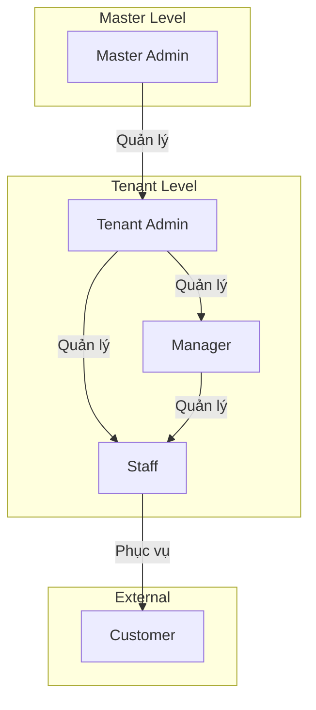

| Tác nhân | Phạm vi | Mô tả |
|----------|---------|-------|
| **Master Admin** | Toàn hệ thống | Quản trị viên cấp cao nhất |
| **Tenant Admin** | 1 Tenant | Quản trị viên doanh nghiệp |
| **Manager** | 1 Tenant | Quản lý cấp trung |
| **Staff** | 1 Tenant | Nhân viên nghiệp vụ |
| **Customer** | External | Khách hàng (không có tài khoản) |

---

# 📋 PHẦN 1: CHI TIẾT WORKFLOWS TỪNG TÁC NHÂN

---

## 🔴 1. Master Admin Workflows

### 1.1 Workflow: Onboarding Tenant Mới

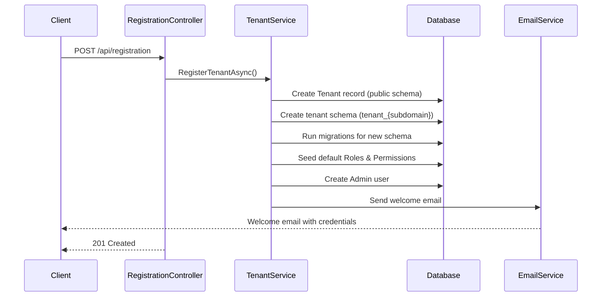

### 1.2 Workflow: Quản Lý Subscription

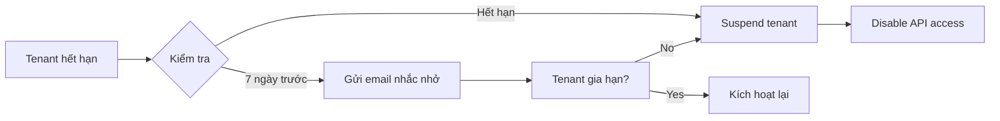

**API Endpoints:**
- `GET /api/master/tenants` - Xem danh sách
- `PUT /api/master/tenants/{id}` - Cập nhật trạng thái
- `GET /api/master/subscriptions` - Xem subscriptions
- `PUT /api/master/subscriptions/extend` - Gia hạn

### 1.3 Workflow: Database Migration

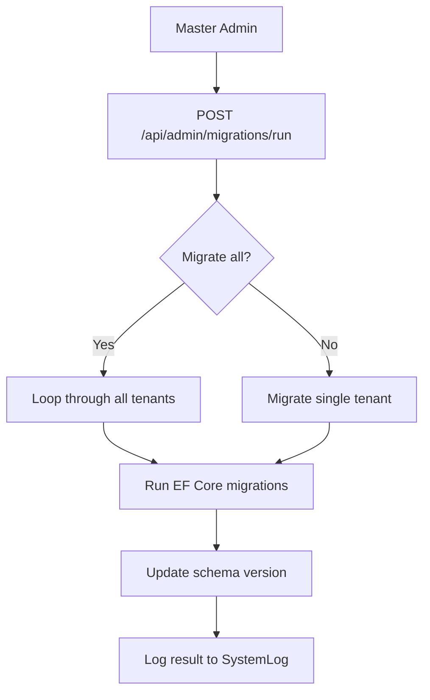

---

## 🟠 2. Tenant Admin Workflows

### 2.1 Workflow: Quản Lý Users

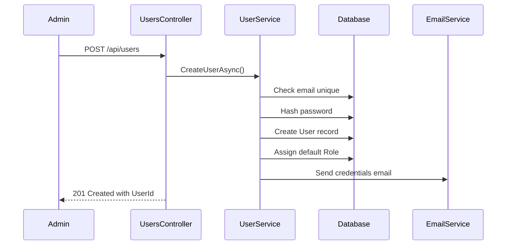

### 2.2 Workflow: Cấu Hình RBAC

```mermaid
flowchart TD
    A[Admin đăng nhập] --> B[Tạo Role mới]
    B --> C[Chọn Permissions]
    C --> D[POST /api/roles]
    D --> E[Gán Users vào Role]
    E --> F[POST /api/roles/{id}/assign-users]
    F --> G[Users nhận permissions mới]
```

### 2.3 Workflow: Upload AI Document

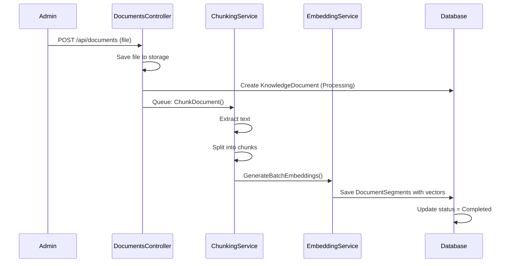

---

## 🟡 3. Manager Workflows

### 3.1 Workflow: Tạo Đơn Hàng

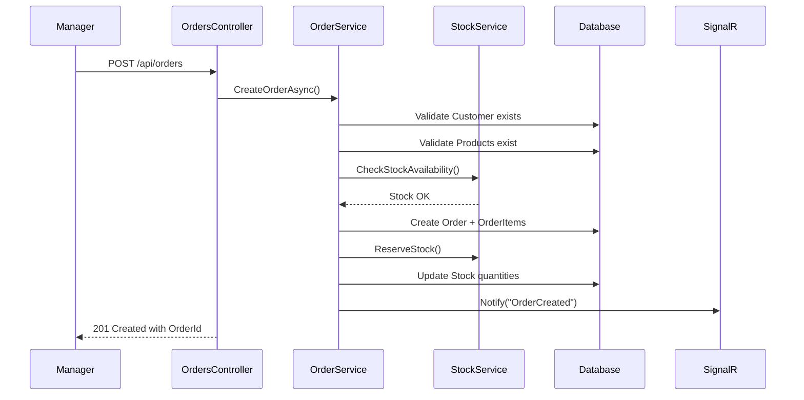

### 3.2 Workflow: Điều Chỉnh Tồn Kho

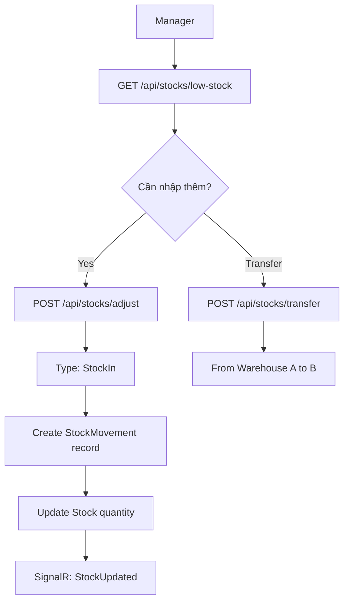

### 3.3 Workflow: Xử Lý Invoice

```mermaid
flowchart LR
    A[Order Completed] --> B[POST /api/invoices]
    B --> C[Invoice Created]
    C --> D{Customer thanh toán?}
    D -->|Yes| E[PUT /api/invoices/{id}/pay]
    E --> F[Status = Paid]
    D -->|No| G[Quá hạn 7 ngày]
    G --> H[InvoiceReminderJob]
    H --> I[Gửi email nhắc nhở]
```

---

## 🟢 4. Staff Workflows

### 4.1 Workflow: Bán Hàng Cơ Bản

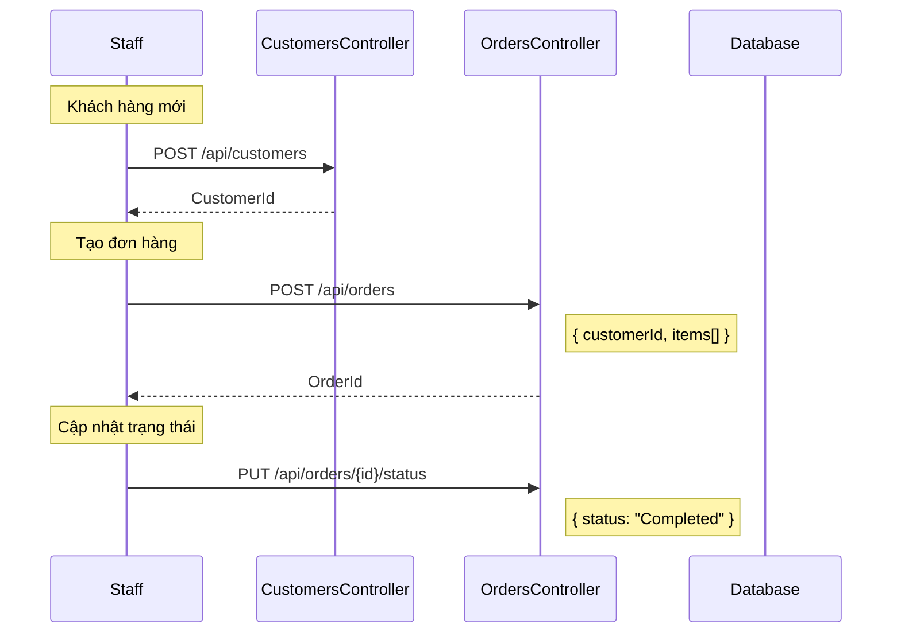

### 4.2 Workflow: Sử Dụng AI Chat

```mermaid
flowchart TD
    A[Staff] --> B[POST /api/chat]
    B --> C[Hỏi: "Sản phẩm ABC còn bao nhiêu?"]
    C --> D[RAGService tìm context]
    D --> E[VectorSearch trong documents]
    E --> F[GeminiChatService trả lời]
    F --> G[Trả về câu trả lời]
```

---

## 🔵 5. Customer Workflows (Tương tác gián tiếp)

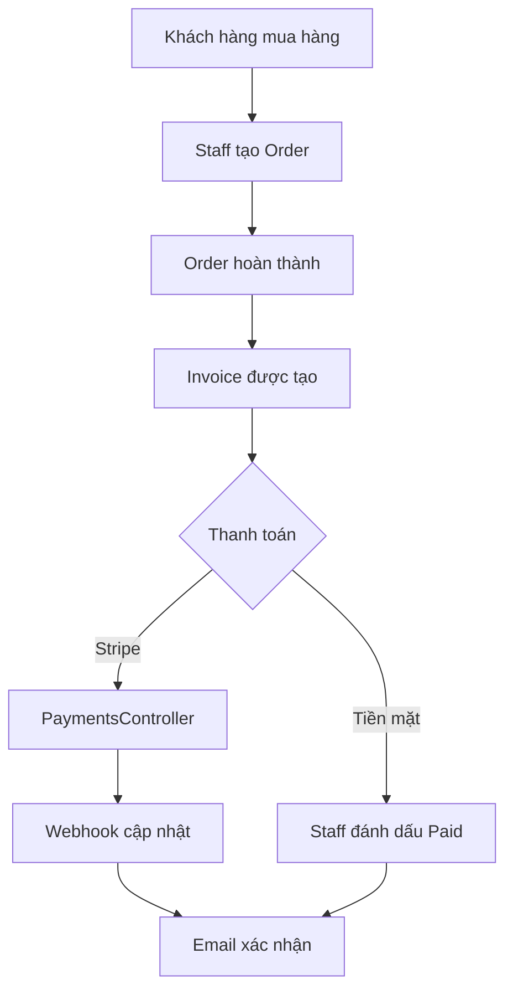

---

# 📐 PHẦN 2: USE CASE DIAGRAMS

---

## 🔐 Module: Identity

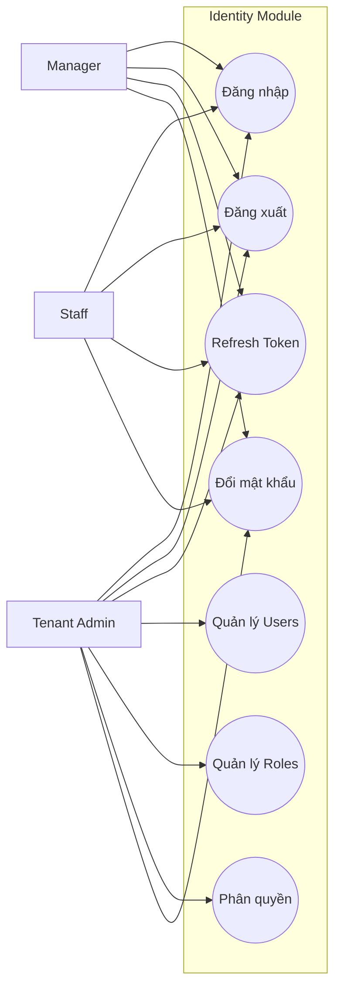

**API Endpoints:**
| Use Case | Endpoint | Actors |
|----------|----------|--------|
| Đăng nhập | `POST /api/auth/login` | All |
| Đăng xuất | `POST /api/auth/logout` | All |
| Refresh Token | `POST /api/auth/refresh` | All |
| CRUD Users | `GET/POST/PUT/DELETE /api/users` | Admin |
| CRUD Roles | `GET/POST/PUT/DELETE /api/roles` | Admin |
| Gán Permissions | `POST /api/roles/{id}/assign-permissions` | Admin |

---

## 📦 Module: Inventory

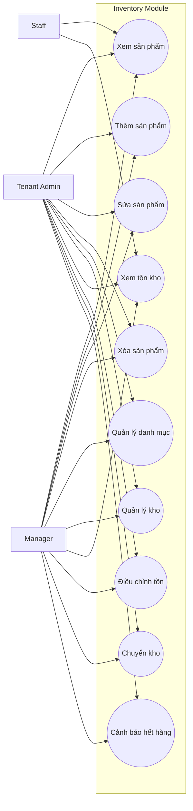

**API Endpoints:**
| Use Case | Endpoint |
|----------|----------|
| CRUD Products | `GET/POST/PUT/DELETE /api/products` |
| CRUD Categories | `GET/POST/PUT/DELETE /api/categories` |
| CRUD Units | `GET/POST/PUT/DELETE /api/units` |
| CRUD Warehouses | `GET/POST/PUT/DELETE /api/warehouses` |
| Xem tồn kho | `GET /api/stocks` |
| Điều chỉnh | `POST /api/stocks/adjust` |
| Chuyển kho | `POST /api/stocks/transfer` |
| Cảnh báo | `GET /api/stocks/low-stock` |

---

## 💼 Module: Sales & CRM

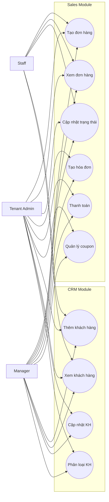

**API Endpoints:**
| Use Case | Endpoint |
|----------|----------|
| CRUD Orders | `GET/POST/PUT /api/orders` |
| Update Status | `PUT /api/orders/{id}/status` |
| CRUD Invoices | `GET/POST /api/invoices` |
| Mark Paid | `PUT /api/invoices/{id}/pay` |
| CRUD Coupons | `GET/POST/PUT/DELETE /api/coupons` |
| Validate Coupon | `GET /api/coupons/{code}/validate` |
| CRUD Customers | `GET/POST/PUT/DELETE /api/customers` |

---

## 🤖 Module: AI

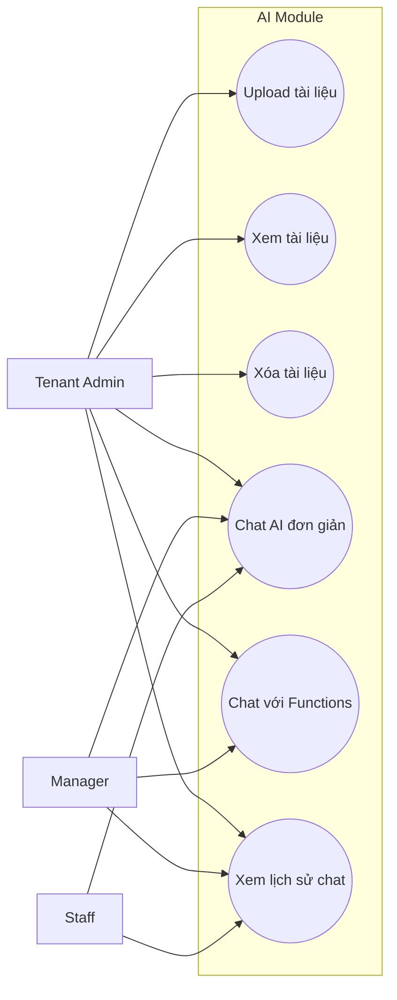

**API Endpoints:**
| Use Case | Endpoint |
|----------|----------|
| Upload | `POST /api/documents` |
| List Documents | `GET /api/documents` |
| Delete | `DELETE /api/documents/{id}` |
| Chat | `POST /api/chat` |
| Chat Functions | `POST /api/chat/with-functions` |
| History | `GET /api/chat/history` |

---

## 🛡️ Module: Master Admin

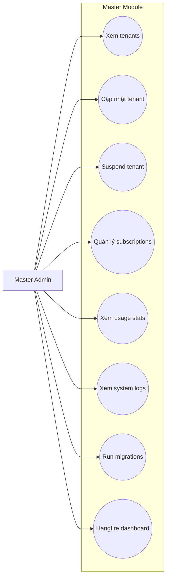

**API Endpoints:**
| Use Case | Endpoint |
|----------|----------|
| Tenants | `GET/PUT /api/master/tenants` |
| Subscriptions | `GET/PUT /api/master/subscriptions` |
| Usage | `GET /api/master/usage` |
| Logs | `GET /api/master/logs` |
| Migrations | `POST /api/admin/migrations/run` |
| Hangfire | `/hangfire` |

---

# 🔐 PHẦN 3: PERMISSION CODES CHI TIẾT

---

## 📋 Danh Sách Permission Codes

### 1. Identity Permissions

| Code | Mô tả | Admin | Manager | Staff |
|------|-------|:-----:|:-------:|:-----:|
| `users.read` | Xem danh sách users | ✅ | ❌ | ❌ |
| `users.create` | Tạo user mới | ✅ | ❌ | ❌ |
| `users.update` | Cập nhật user | ✅ | ❌ | ❌ |
| `users.delete` | Xóa/vô hiệu user | ✅ | ❌ | ❌ |
| `roles.read` | Xem danh sách roles | ✅ | ❌ | ❌ |
| `roles.create` | Tạo role mới | ✅ | ❌ | ❌ |
| `roles.update` | Cập nhật role | ✅ | ❌ | ❌ |
| `roles.delete` | Xóa role | ✅ | ❌ | ❌ |
| `permissions.read` | Xem permissions | ✅ | ❌ | ❌ |
| `permissions.assign` | Gán permissions | ✅ | ❌ | ❌ |

### 2. Inventory Permissions

| Code | Mô tả | Admin | Manager | Staff |
|------|-------|:-----:|:-------:|:-----:|
| `products.read` | Xem sản phẩm | ✅ | ✅ | ✅ |
| `products.create` | Thêm sản phẩm | ✅ | ✅ | ❌ |
| `products.update` | Sửa sản phẩm | ✅ | ✅ | ❌ |
| `products.delete` | Xóa sản phẩm | ✅ | ✅ | ❌ |
| `categories.read` | Xem danh mục | ✅ | ✅ | ✅ |
| `categories.manage` | CRUD danh mục | ✅ | ✅ | ❌ |
| `units.read` | Xem đơn vị | ✅ | ✅ | ✅ |
| `units.manage` | CRUD đơn vị | ✅ | ✅ | ❌ |
| `warehouses.read` | Xem kho | ✅ | ✅ | ✅ |
| `warehouses.manage` | CRUD kho | ✅ | ✅ | ❌ |
| `stocks.read` | Xem tồn kho | ✅ | ✅ | ✅ |
| `stocks.adjust` | Điều chỉnh tồn | ✅ | ✅ | ❌ |
| `stocks.transfer` | Chuyển kho | ✅ | ✅ | ❌ |

### 3. Sales Permissions

| Code | Mô tả | Admin | Manager | Staff |
|------|-------|:-----:|:-------:|:-----:|
| `orders.read` | Xem đơn hàng | ✅ | ✅ | ✅ |
| `orders.create` | Tạo đơn hàng | ✅ | ✅ | ✅ |
| `orders.update` | Cập nhật đơn | ✅ | ✅ | ✅ |
| `orders.delete` | Hủy đơn | ✅ | ✅ | ❌ |
| `invoices.read` | Xem hóa đơn | ✅ | ✅ | ❌ |
| `invoices.create` | Tạo hóa đơn | ✅ | ✅ | ❌ |
| `invoices.update` | Cập nhật hóa đơn | ✅ | ✅ | ❌ |
| `coupons.read` | Xem coupons | ✅ | ✅ | ✅ |
| `coupons.manage` | CRUD coupons | ✅ | ✅ | ❌ |
| `payments.process` | Xử lý thanh toán | ✅ | ✅ | ❌ |

### 4. CRM Permissions

| Code | Mô tả | Admin | Manager | Staff |
|------|-------|:-----:|:-------:|:-----:|
| `customers.read` | Xem khách hàng | ✅ | ✅ | ✅ |
| `customers.create` | Thêm khách hàng | ✅ | ✅ | ✅ |
| `customers.update` | Cập nhật KH | ✅ | ✅ | ❌ |
| `customers.delete` | Xóa khách hàng | ✅ | ✅ | ❌ |

### 5. AI Permissions

| Code | Mô tả | Admin | Manager | Staff |
|------|-------|:-----:|:-------:|:-----:|
| `documents.read` | Xem tài liệu AI | ✅ | ❌ | ❌ |
| `documents.upload` | Upload tài liệu | ✅ | ❌ | ❌ |
| `documents.delete` | Xóa tài liệu | ✅ | ❌ | ❌ |
| `chat.use` | Sử dụng AI chat | ✅ | ✅ | ✅ |
| `chat.functions` | Chat với functions | ✅ | ✅ | ❌ |

### 6. Reports Permissions

| Code | Mô tả | Admin | Manager | Staff |
|------|-------|:-----:|:-------:|:-----:|
| `dashboard.view` | Xem dashboard | ✅ | ✅ | ❌ |
| `reports.revenue` | Báo cáo doanh thu | ✅ | ✅ | ❌ |
| `reports.products` | Báo cáo sản phẩm | ✅ | ✅ | ❌ |
| `reports.customers` | Báo cáo KH | ✅ | ✅ | ❌ |
| `reports.export` | Xuất Excel | ✅ | ❌ | ❌ |

### 7. Settings Permissions

| Code | Mô tả | Admin | Manager | Staff |
|------|-------|:-----:|:-------:|:-----:|
| `settings.read` | Xem cài đặt | ✅ | ❌ | ❌ |
| `settings.update` | Cập nhật cài đặt | ✅ | ❌ | ❌ |
| `auditlogs.read` | Xem audit logs | ✅ | ❌ | ❌ |

---

## 🔧 Cơ Chế Kiểm Tra Permission

### 1. Trong Controller (Attribute-based)

```csharp
[Authorize(Policy = "RequirePermission:products.create")]
[HttpPost]
public async Task<IActionResult> CreateProduct(CreateProductRequest request)
{
    // Logic tạo sản phẩm
}
```

### 2. Trong Service (Code-based)

```csharp
public async Task AdjustStock(Guid productId, int quantity)
{
    var userId = _currentUserService.GetUserId();
    
    if (!await _permissionService.HasPermission(userId, "stocks.adjust"))
    {
        throw new UnauthorizedException("ERR_FORBIDDEN");
    }
    
    // Logic điều chỉnh tồn kho
}
```

### 3. JWT Claims Structure

```json
{
  "sub": "20000000-0000-0000-0000-000000000001",
  "tenantId": "aaaaaaaa-aaaa-aaaa-aaaa-aaaaaaaaaaaa",
  "email": "admin@novasaas.com",
  "roles": ["Admin"],
  "permissions": [
    "products.read",
    "products.create",
    "products.update",
    "products.delete",
    "orders.read",
    "orders.create",
    "orders.update",
    "orders.delete",
    "customers.read",
    "customers.create",
    "customers.update",
    "customers.delete"
  ],
  "iat": 1707004800,
  "exp": 1707091200
}
```

### 4. Policy Registration (Program.cs)

```csharp
builder.Services.AddAuthorization(options =>
{
    // Dynamic policy registration
    var permissions = new[] 
    { 
        "products.read", "products.create", "products.update", "products.delete",
        "orders.read", "orders.create", "orders.update", "orders.delete",
        // ... other permissions
    };
    
    foreach (var permission in permissions)
    {
        options.AddPolicy($"RequirePermission:{permission}", policy =>
            policy.RequireClaim("permissions", permission));
    }
});
```

---

## 📊 Ma Trận Tổng Hợp

| Module | Total Permissions | Admin | Manager | Staff |
|--------|:-----------------:|:-----:|:-------:|:-----:|
| Identity | 10 | 10 | 0 | 0 |
| Inventory | 13 | 13 | 12 | 4 |
| Sales | 10 | 10 | 10 | 4 |
| CRM | 4 | 4 | 4 | 2 |
| AI | 5 | 5 | 2 | 1 |
| Reports | 5 | 5 | 4 | 0 |
| Settings | 3 | 3 | 0 | 0 |
| **TOTAL** | **50** | **50** | **32** | **11** |

---

## 🗃️ Database Schema cho RBAC

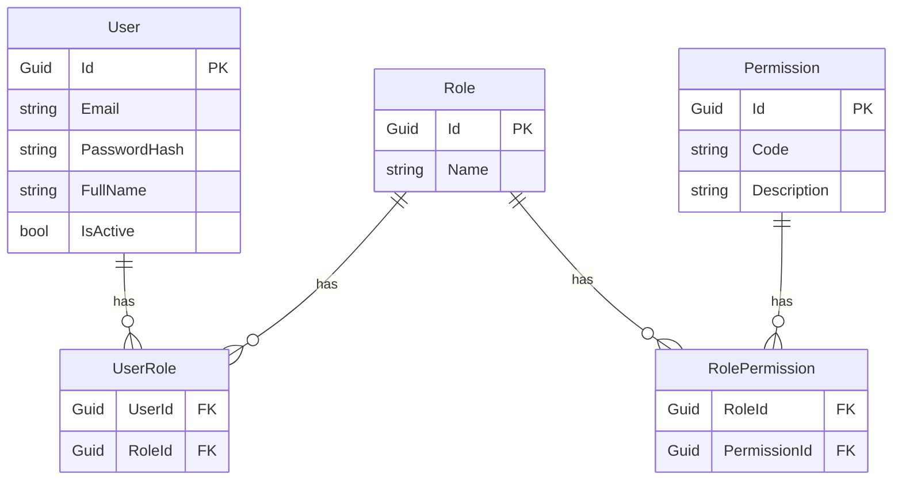

---

## 🎯 Kết Luận

Hệ thống NovaSaaS áp dụng mô hình **RBAC (Role-Based Access Control)** với:

| Metric | Giá trị |
|--------|---------|
| Tổng số tác nhân | 5 (1 Master + 4 Tenant-level) |
| Default roles | 4 (Admin, Manager, Staff, User) |
| Permission codes | 50 |
| Modules | 7 |
| API Controllers | 24+ |
| Domain Entities | 32 |

**Đặc điểm nổi bật:**
- ✅ Multi-tenant với schema isolation
- ✅ Flexible permission assignment
- ✅ Custom roles support
- ✅ JWT-based authentication
- ✅ Attribute-based authorization
- ✅ Audit logging

---

© 2026 NovaSaaS Analysis Document
